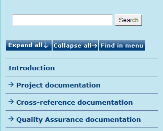

# Search functionality {#howToUseHTMLDocumentation .concept}

It is possible to use search functionality in generated HTML document. It can be done through typing search expression into input box and pressing search button. Also advanced searching expressions can be used for this purpose including boolean expressions \(if more words are typed, OR relation is used by default between them\).

Basically the functionality is done by using **Java applet** in documentation to search in document placed in **local folders** or in the **intranet**.

It is also possible to utilize searching on **web server** - for this purpose **jsp pages** are used. There's need to download and install Apache Tomcat from [http://tomcat.apache.org](http://tomcat.apache.org). Then exact path to generated documentation can be set as root webapps directory - file conf/server.xml, element Host, attribute appbase. This can be very useful to set in generation script to change this directory to lastly generated HTML snapshot.

Note: If Mozilla Firefox is used for local browsing, there's need to use JRE of version 1.6.0\_10 or newer for applet functionality.

**Parent topic:**[Generated output](../../../modules/falcon/output/index.md)

